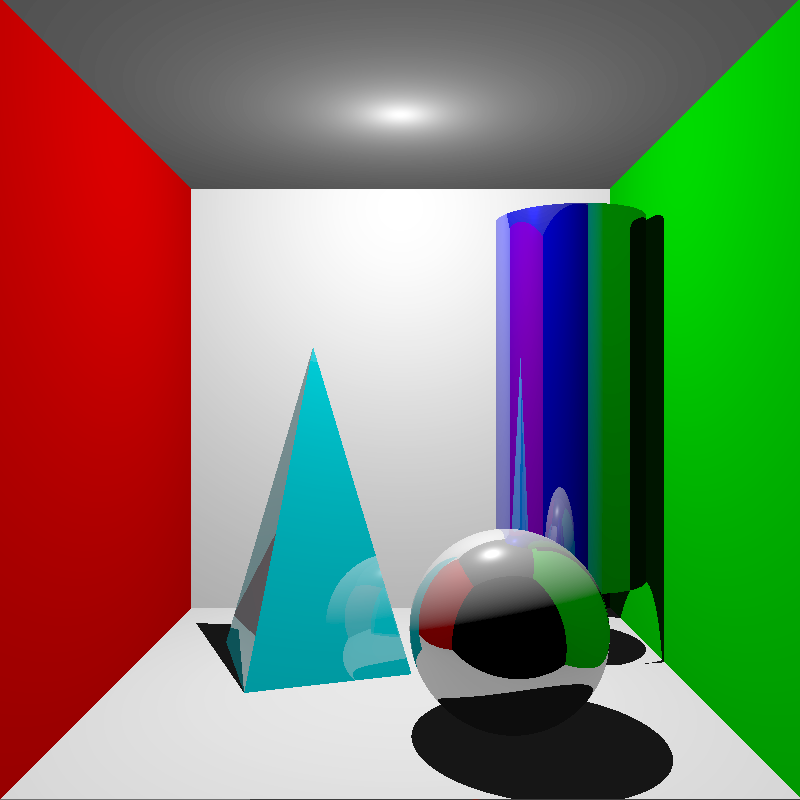
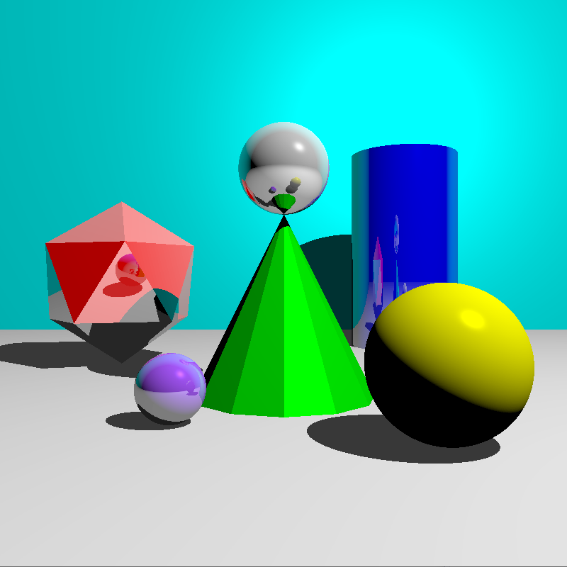

# computer-graphics-assignments

Collection of assignments I've completed for an Introduction to Computer Graphics course. OpenGL and C++ were used to complete all these assignments. 

1. [Ray Tracing Demo](#ray-tracing-demo)
1. [Solar System Simulation](#solar-system-simulation)
1. [Interactive Curve Editor](#interactive-curve-editor)
1. [Spaceship Game](#spaceship-game)
1. [Fractal Generator](#fractal-generator)

## Ray Tracing Demo

This is a CPU implementation of ray tracing that demonstrates the use of Reflections and Shadow Rays.

There are 2 Scene in this demo. The program automatically starts on Scene 1.

### Scene 1

### Scene 2

### Controls

- Press `1` to switch to Scene 1
- Press `2` to switch to Scene 2

**Note:** It takes some time to load the scenes

## Platform and Compiler

Visual Studio 2022 was used to compile and run the source code

Platform (OS): Windows 10 Pro

Compiler: C++17
