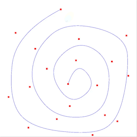

# Curve Editor

This programs allows the user to create custom Bezier and B-Spline curves and visualize it in different ways. 

Pre-defined Tensor Product Surfaces can also be visualized in this program.

## 2D Curve Editor

- Left Click an empty location to add a new point (Point gets added at the release location)
- Hold Left click on a point to select it and move it around. Release left click to un-select that point
- Right Click on a point to delete it
- Press `R` to clear all points from the window
- Press `B` to toggle between a Bezier and B-spline curve

## 3D Curve Viewer

- Look around by moving your mouse
- Move forward/backwards using `W`/`S` respectively
- Move right/left using `D`/`A` respectively
- Move up/down using `space`/`left ctrl` respectively
- Press `B` to toggle between a Bezier and B-spline curve

## 3D Curve Surface of Revolution

- Only the B-Spline curve is used for this scene
- Look around by moving your mouse
- Move forward/backwards using `W`/`S` respectively
- Move right/left using `D`/`A` respectively
- Move up/down using `space`/`left ctrl` respectively
- Press `N` to toggle between a wireframe and solid surface

## Tensor Product Surfaces

- Look around by moving your mouse
- Move forward/backwards using `W`/`S` respectively
- Move right/left using `D`/`A` respectively
- Move up/down using `space`/`left ctrl` respectively
- Press `N` to toggle between a wireframe and solid surface
- Press `T` to toggle between the predefined surface and the custom surface

## General

Update the `MOVE_SPEED` and `MOUSE_SENSITIVITY` constants at the top of the main.cpp file to a value that works for you.

Toggle between the different scenes using these keys:
- `1`: 2D Curve editor
- `2`: 3D Curve Viewer
- `3`: 3D Curve Surface of Revolution Viewer
- `4`: Tensor Product Surface Viewer

To exit the program, switch to the 2D Curve Editor Scene (`1`) and close the window.
