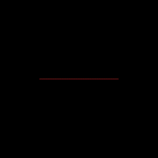
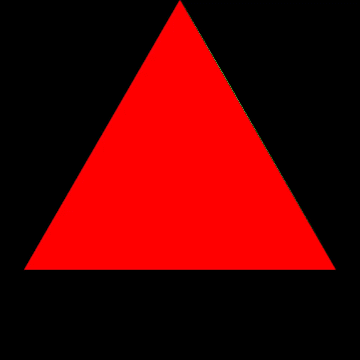
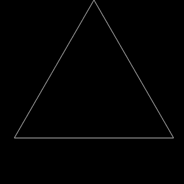
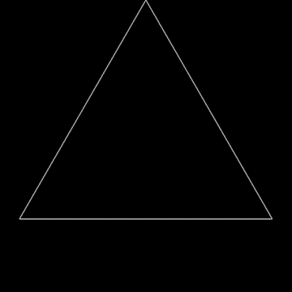

# Fractal Generator

## Dragon Curve

## Sierpinski Triangle

## Uniform Base Triangle

## Koch Snowflake

## Controls

To control the number of iterations, use the **`up/right`** arrow keys to increase the iteration by 1 and use the **`down/left`** arrows keys to decrease the iteration by 1. The program can go up to 8 iterations for each fractal type.  

The following number keys can be pressed to switch between the different fractal types. When switching fractals, the iteration will always reset back to 0:
- `1`: Sierpinski Triangle
- `2`: Uniform Base Triangle
- `3`: Koch Snowflake
- `4`: Dragon Curve
