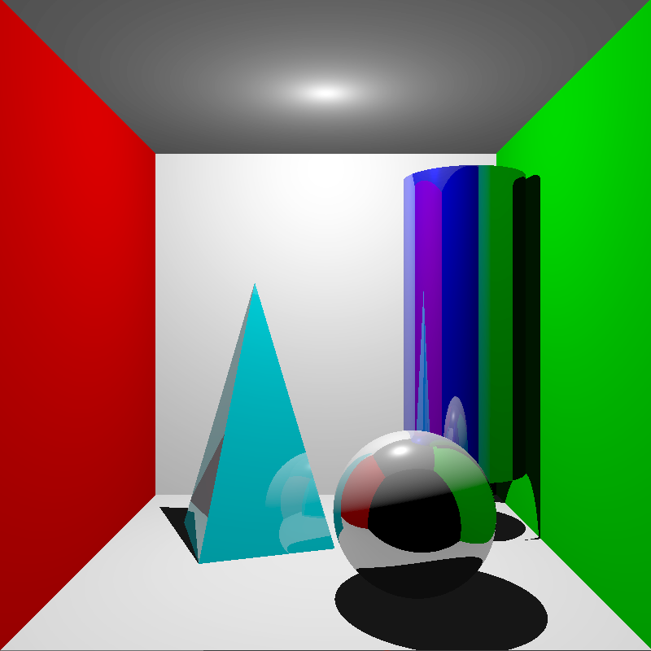
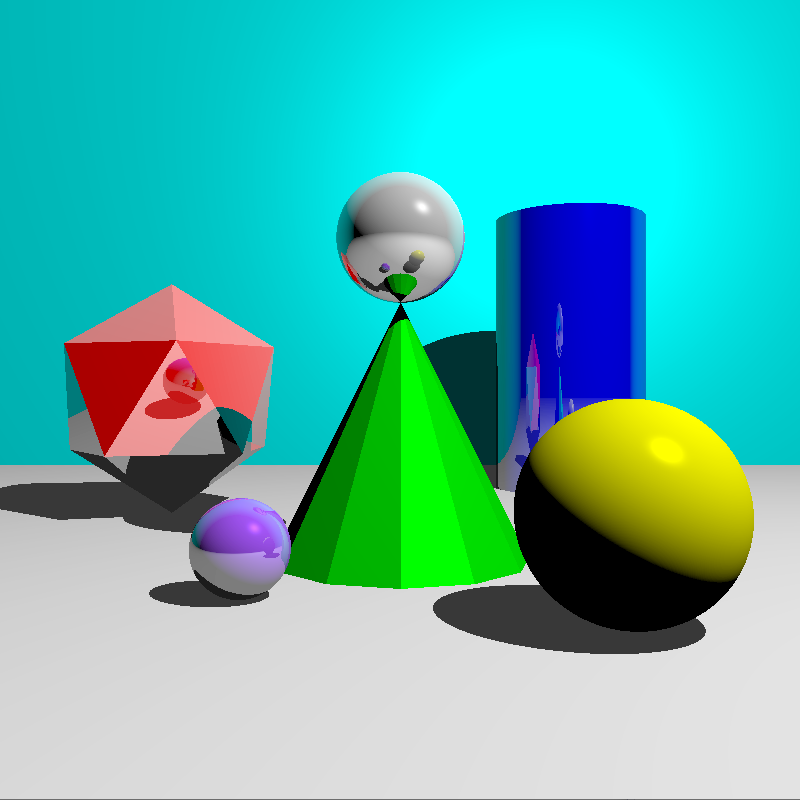

# Ray Tracing Demo

This is a CPU implementation of ray tracing that demonstrates the use of Reflections and Shadow Rays.

There are 2 Scenes in this demo. The program automatically starts on Scene 1.

## Scene 1

## Scene 2

## Controls

- Press `1` to switch to Scene 1
- Press `2` to switch to Scene 2

**Note:** It takes some time to load the scenes